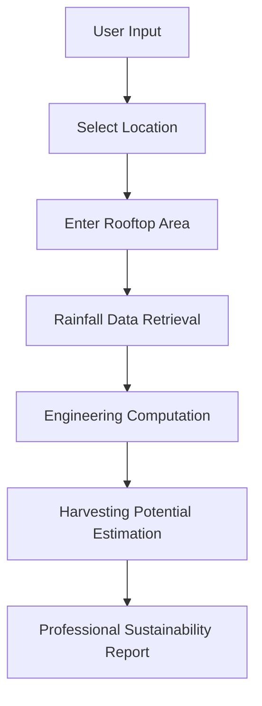
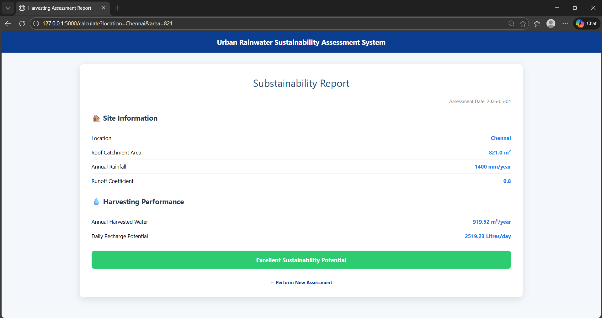
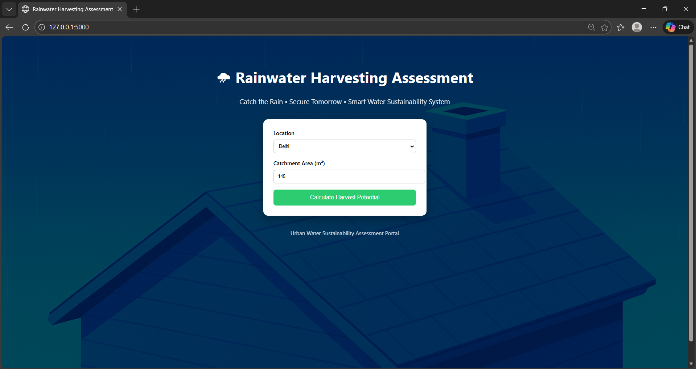
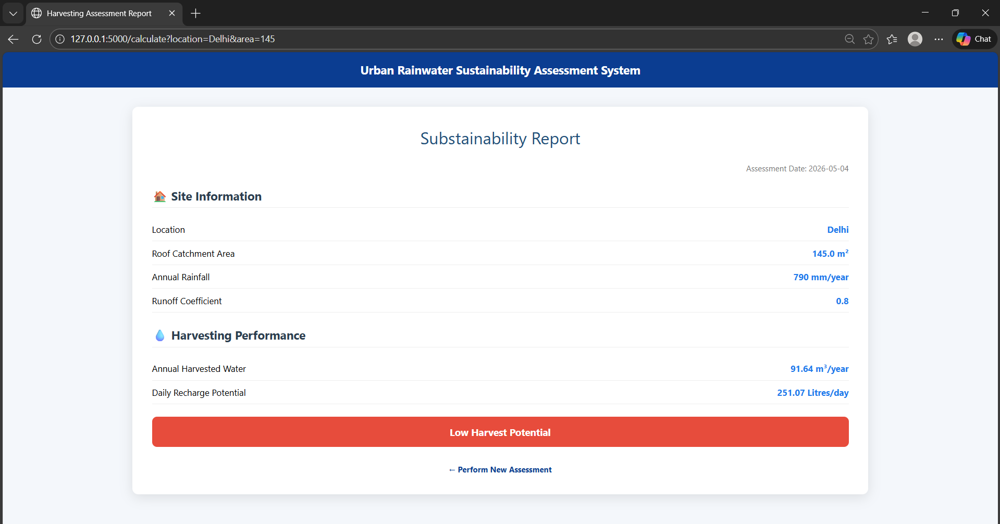

# 🌧 Rainwater Harvesting Assessment System

**Catch the Rain, Secure Tomorrow — Intelligent Rooftop Rainwater & Groundwater Recharge Assessment**

A web-based **Urban Water Sustainability Assessment Tool** developed using Flask (Python) to estimate rooftop rainwater harvesting potential, groundwater recharge capacity, and sustainability performance using environmental engineering computation models.

## 📌 Project Overview

Rapid urban expansion and climate variability are creating severe pressure on groundwater resources. Many buildings possess unused rooftop potential for rainwater harvesting, yet lack accessible evaluation tools.

This system provides an **instant engineering-based sustainability assessment** that calculates how much rainwater can be harvested from a rooftop using regional rainfall data and standardized hydrological formulas.

The platform simulates a professional environmental assessment system applicable to:

 - Smart City Planning
 - Sustainable Urban Infrastructure
 - Environmental Engineering Studies
 - Green Building Certification Analysis
 - Water Resource Management
 - Urban Sustainability Audits

## 🚀 Key Features

 - City-based rainfall analysis
 - Rooftop rainwater collection calculation
 - Runoff coefficient based modelling
 - Annual rainwater harvesting estimation
 - Daily groundwater recharge calculation
 - Sustainability rating system
 - Report-style results dashboard
 - Simple and responsive web interface
 - Fast real-time calculations


## 🏗️ Technology Stack
| Layer            | Technology Used                             |
| :--------------: | :-----------------------------------------: |
| Backend          | Python                                      |
| Web Framework    | Flask                                       |
| Frontend         | HTML                                        |
| Styling          | CSS                                         |
| Data Handling    | Static Rainfall Dataset (Python Dictionary) |
| Computation      | Hydrological Calculations                   |
| Application Type | Environmental Decision Support System       |

## 📊 Data Handling Approach

The application currently uses an:

**Embedded Static Rainfall Dataset**

implemented using a **Python Dictionary** structure containing annual rainfall values (mm/year) for major Indian cities.

Example data model:
```
rainfall_data = {
    "Chennai": 1400,
    "Mumbai": 2200,
    "Delhi": 790
}
```

**Why this approach?**
 - Works even without internet connection
 - Easy to deploy and run
 - Shows how environmental calculations are performed
 - Serves as a prototype environmental assessment system

## 🔮 Future Enhancement — Official Rainfall API Integration

Future versions will connect with real weather data sources.

**Planned Updates**
 - Use government weather APIs
 - Get real-time rainfall data
 - Automatic location-based rainfall detection

**Possible Integrations**
 - Indian Meteorological Department (IMD) data services
 - OpenWeather climate APIs
 - Satellite rainfall observation systems

**Benefits**
 - Automatic location detection
 - Live rainfall analysis
 - More accurate environmental results
 - Ready for smart city applications

## ⚙️ Engineering Calculation Model

The system follows standard **Rainwater Harvesting Engineering Principles** used in hydrology and environmental design.

### 1️⃣ Annual Rainwater Harvesting Formula

$$
\text{Harvested Water (m³/year)} =
\frac{\text{Rainfall} \times \text{Catchment Area} \times \text{Runoff Coefficient}}{1000}
$$

**Parameters**
 - Rainfall:	Annual rainfall (mm/year)
 - Catchment Area:	Rooftop area (m²)
 - Runoff Coefficient:	Surface efficiency factor
 - 1000:	Unit conversion from mm to meters

### 2️⃣ Runoff Coefficient (Engineering Standard)

For RCC rooftops:

$$
Runoff Coefficient = 0.8
$$

Meaning:

 - **80%** rainfall becomes collectible runoff
 - **20%** loss due to evaporation, splash loss, absorption, and leakage

This value follows commonly accepted rainwater harvesting design standards.

### 3️⃣ Daily Groundwater Recharge Potential

$$
\text{Daily Recharge (Litres/day)} =
\frac{\text{Annual Harvested Water} \times 1000}{365}
$$

**📈 Sustainability Rating Logic**

| Daily Recharge   | Sustainability Assessment          |
| ---------------- | ---------------------------------- |
| > 1500 L/day     | Excellent Sustainability Potential |
| 700 – 1500 L/day | Moderate Sustainability            |
| < 700 L/day      | Low Harvest Potential              |

## 🧭 Application Workflow


## 🌧️ High Scenario 1 (Chennai Location)

### Input Page 

This screen shows the user input configuration for Chennai, where parameters such as rooftop catchment area and rainfall data are provided to evaluate rainwater harvesting potential.

<p align="center">
 


</p>

### Output Page (Excellent Sustainability Potential)

The assessment result indicates Excellent Sustainability Potential, showing high efficiency in rainwater harvesting and strong suitability for sustainable urban water management in this region.

<p align="center">
 


</p>

🌧️ Low Scenario 1 (Delhi Location)
### Input Page 

This screen represents the input setup for Delhi, where the system takes rooftop area, rainfall, and runoff coefficient to compute harvesting feasibility under local climatic conditions.

<p align="center">
 


</p>

### Output Page (Low Harvest Potential)

The output highlights Low Harvest Potential, indicating limited rainwater harvesting efficiency due to regional rainfall characteristics and runoff conditions.

<p align="center">
 


</p>
